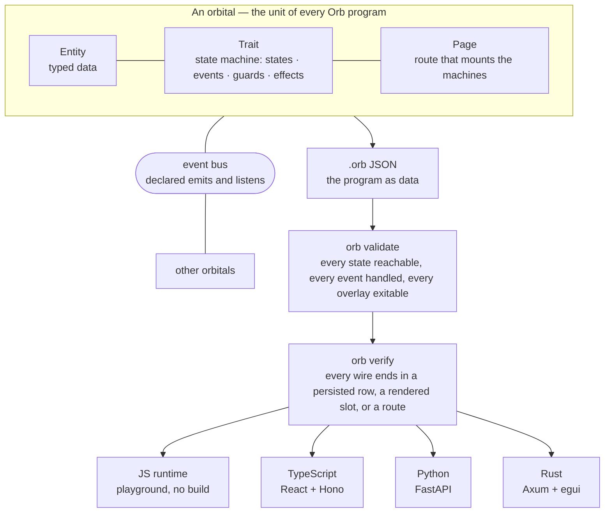
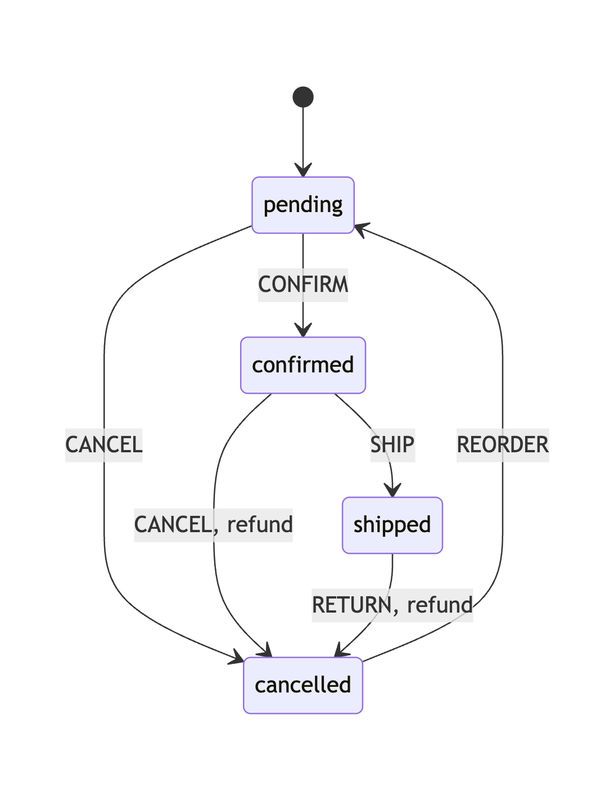
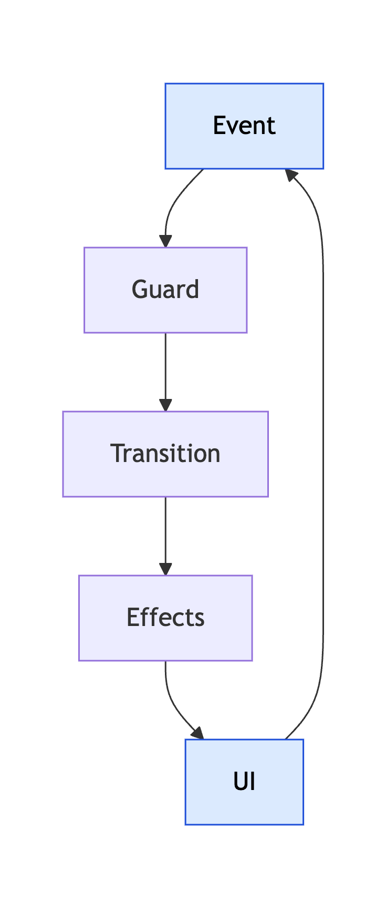

# Orb

> Orb is a general-purpose language for reactive applications built on a restricted execution model. Every program is a state machine bound to typed data, composed with other machines over declared events. The compiler checks the whole graph before anything runs, then emits the same program as TypeScript, Python, or Rust — UI included.



[Playground](https://orb.almadar.io/playground) · [Docs](https://orb.almadar.io/docs/getting-started/introduction) · [Standard library](https://orb.almadar.io/docs/reference/standard-library) · [Blog](https://orb.almadar.io/blog) · [Discord](https://discord.gg/q83VjPJx)

```bash
curl -fsSL https://orb.almadar.io/install.sh | sh
```

---

## Where does the behavior of a thing live in your codebase?

Not the data. Not the UI. The *behavior*: which states an order can be in, which actions are legal in each, what must happen when one fires, and what can happen next.

If you can point to it, you probably don't need Orb. Most of us cannot point to it. It is smeared across services, hooks, components, controllers, and the heads of two people who left last year.

OOP got the noun: an order is a thing with identity. But the rule *can a pending order ship?* ends up as an `if` in the model, another in the service, a third in the controller, a fourth in the button. FP and declarative UI got the loop: state to view to handler and back. But `setStatus("shipped")` is legal from every state, the side effects escape into a `useEffect`, and nothing can tell you the modal you just opened has no handler that closes it.

Neither made behavior something a compiler can hold. Orb does. Everything else, the data, the effects, the UI, the routes, and the code for each target platform, hangs off it.

## The order machine

Here is the whole answer to *can a pending order ship?* Not four copies. Zero.

```lolo
app Orders v1

orbital OrderOrbital {
  entity Order [persistent: orders] {
    id       : string!
    status   : string
    total    : number
    refunded : boolean
  }

  trait OrderLifecycle -> Order [lifecycle] {
    initial: pending

    state pending {
      CONFIRM -> confirmed
        (set @entity.id ?row.id)
        (set @entity.status "confirmed")
        (persist update Order { id: @entity.id, status: "confirmed" })

      CANCEL -> cancelled
        (set @entity.id ?row.id)
        (set @entity.status "cancelled")
        (persist update Order { id: @entity.id, status: "cancelled" })
    }

    state confirmed {
      SHIP -> shipped
        (set @entity.id ?row.id)
        (set @entity.status "shipped")
        (persist update Order { id: @entity.id, status: "shipped" })
        (notify "success" "Order shipped")

      CANCEL -> cancelled
        (set @entity.id ?row.id)
        (set @entity.status "cancelled")
        (set @entity.refunded true)
        (persist update Order { id: @entity.id, status: "cancelled", refunded: true })
    }

    state shipped {
      RETURN -> cancelled
        (set @entity.id ?row.id)
        (set @entity.status "cancelled")
        (set @entity.refunded true)
        (persist update Order { id: @entity.id, status: "cancelled", refunded: true })
    }

    state cancelled {
      REORDER -> pending
        (set @entity.id ?row.id)
        (set @entity.status "pending")
        (set @entity.refunded false)
        (persist update Order { id: @entity.id, status: "pending", refunded: false })
    }

    listens {
      CONFIRM { row : Order }
      CANCEL  { row : Order }
      SHIP    { row : Order }
      RETURN  { row : Order }
      REORDER { row : Order }
    }
  }

  page "/orders" -> OrderLifecycle
}
```

Read a transition as a sentence: *while the order is `confirmed`, if `SHIP` arrives, run these effects and move to `shipped`.*

<p align="center"></p>

That diagram was not drawn from an understanding of the code. It *is* the code. Every box is a `state`, every arrow is a line with `->` in it.

**`CANCEL` means different things in different states.** In `pending` it flips the status. In `confirmed` it also refunds. There is no `if (order.wasPaid)` anywhere. The state *is* the condition.

**`SHIP` does not exist in `pending`.** Not "throws an error". Not "is disabled". It is not a transition. The rule is the missing transition, and a compiler that reads this file can prove it.

## What the compiler sees

Because the behavior is a declared graph, `orb validate` walks it. Misspell a target state and you get two errors, not one: the misspelled target does not exist, and the real state is now orphaned.

```plaintext
❌ [ORB_T_INVALID_TRANSITION] Target state 'shiped' does not exist
❌ [ORB_T_STATE_UNREACHABLE] State 'shipped' is unreachable from the initial state 'pending'
```

The same walk checks the data. Write `@entity.state` when the entity declares `status`:

```plaintext
❌ [ORB_BINDING_ENTITY_FIELD_NOT_FOUND] @entity.state — field 'state' not found on entity 'Order' @ 26:15
   💡 Add field 'state' to entity 'Order' or fix the binding path
```

And it checks the circuit itself. A state that renders into a `modal` slot must have a way out, or the user is trapped behind an overlay:

```plaintext
Error: CIRCUIT_NO_OVERLAY_EXIT
  State 'creating' renders to 'modal' slot but has no exit transition.
```

A modal that cannot close is not a bug for QA to find. It is a program that does not compile. That is the design bet of the whole language: **if behavior is a state machine, the compiler can reason about it, and whole categories of bugs stop being possible.**

Because the space of moves is finite, the tests are generated rather than written. For the machine above:

```plaintext
$ orb test orders.orb
Generated 21 test cases:
  transition (6 tests)   pending + CONFIRM → confirmed, confirmed + SHIP → shipped, …
  invalid (14 tests)     pending + SHIP (invalid), shipped + CANCEL (invalid), …
  journey (1 tests)      full journey
```

## Quick start

```bash
# install the orb CLI
curl -fsSL https://orb.almadar.io/install.sh | sh        # macOS / Linux
irm https://orb.almadar.io/install.ps1 | iex              # Windows PowerShell
npm install -g @almadar/orb                               # or npm
brew install almadar-io/tap/orb                           # or Homebrew

# save the order machine above as orders.lolo, then:
orb validate orders.lolo        # 0 errors and 0 warnings, or it does not ship
orb serve orders.lolo           # full-stack app on http://localhost:3030 (bundled runtime, no Node needed)
orb verify orders.lolo          # walk every transition and check each effect lands somewhere

orb emit orb orders.lolo        # the same program as .orb JSON
orb test orders.orb             # generated cases: every legal move, every illegal one, one journey
orb compile orders.lolo --shell typescript                    # React + Express or Hono
orb compile orders.lolo --shell python                        # FastAPI
orb compile orders.lolo --frontend typescript --backend python
```

Or skip the install and open the [playground](https://orb.almadar.io/playground).

## The model

### The closed circuit

Every interaction follows one cycle: a button emits an event, the machine checks whether a transition exists for that event *from the current state*, the guard evaluates, the effects run in order, the new UI presents new buttons. Around again.

<p align="center"></p>

This is the FP loop with two things added. The transitions are a declared table instead of a setter anyone can call. And the side effects, including rendering and persistence, are *part of the transition* instead of exiles in a `useEffect`. So the compiler can walk the whole circuit and ask whether it is closed.

### The orbital

The unit of an Orb program is the orbital. An **entity** contains no logic. A **trait** is a state machine bound to an entity and contains no data of its own. A **page** contains neither; it mounts traits on a route.

```
Orbital = Entity + Traits + Pages
```

### One program, two forms

Lolo, the syntax above, is sugar. Every Orb program is a JSON document called `.orb`, and the two forms convert losslessly. The `SHIP` transition, as the compiler holds it:

```json
{
  "from": "confirmed",
  "event": "SHIP",
  "to": "shipped",
  "effects": [
    ["set", "@entity.id", "@payload.row.id"],
    ["set", "@entity.status", "shipped"],
    ["persist", "update", "Order", { "id": "@entity.id", "status": "shipped" }],
    ["render-ui", "toast", { "type": "alert", "variant": "success", "message": "Order shipped", "dismissible": true }]
  ]
}
```

Effects are S-expressions. Guards are S-expressions. The whole program is data you can diff, query, patch from a script, or generate from another tool. Lolo is for people. JSON is for machines. Notation is cheap. Structure is the artifact.

### Eight kinds of effect, many languages

An Orb program cannot say arbitrary things. In an effect position it can only say eight kinds of things:

| Effect | What it means | Runs on |
|---|---|---|
| `render-ui` | put a pattern in a named slot | client |
| `navigate` | change the route | client |
| `notify` | toast | client |
| `persist` | create, update, delete a row | server |
| `fetch` | query rows | server |
| `call-service` | reach an external API | server |
| `emit` | publish an event to other machines | both |
| `set` | change a field | both |

A closed vocabulary means a backend is a *mapping*, not a reimplementation. To add a language, you teach it what `persist` means there, what `render-ui` means in its UI toolkit, and how its event bus carries `emit`. The state machine semantics, the validation, and the application never change.

Because the split between client-side and server-side effects is *in the language*, mixed compilation falls out for free, and so does the **mirrored machine**: the same state table compiled twice. The browser copy runs the client effects. The server copy runs the server effects and returns the client effects it collected. Neither copy can have a different opinion about which transitions are legal, because both were generated from the same table.

## Composition: state machines you import

Writing a list page is not interesting work. The standard library ships it, and a hundred other behaviors, as state machines with a **fixed topology** and a configurable surface. You cannot add a state to a machine you imported. If a consumer needs a transition the atom does not have, the atom is incomplete: fix the atom, not the consumer.

What you *can* do is bind, rename, and configure:

| Override | Effect |
|---|---|
| `-> Order` | bind the machine to your entity |
| `events { EDIT: SHIP }` | rename events at the call site |
| `on EVENT { ... }` | replace the effects of a transition |
| `config { ... }` | set the declared knobs: fields, actions, page size, look |
| `listens { ... }` | wire other machines' events into this one |
| `emitsScope` | `internal` or `external` |

Add a list view to the order machine:

```lolo
uses Browse from "std/behaviors/std-browse"

trait OrderBrowse = Browse.traits.BrowseItemBrowse -> Order {
  events { EDIT: SHIP, DELETE: CANCEL }
  config {
    fields: [{ name: "status" }, { name: "total", format: currency }]
    itemActions: [
      { label: "Ship",   event: "SHIP" }
      { label: "Cancel", event: "CANCEL" }
    ]
  }
  emitsScope internal
}

page "/orders" -> OrderBrowse, OrderLifecycle
```

The browse behavior renders a Ship button. It has no idea what shipping is. The button emits `SHIP` onto the page's event bus, and `OrderLifecycle`, sitting on the same page, either has a `SHIP` transition from its current state or it does not. Two machines, one bus, no inheritance.

Machines never call each other. When events cross between them, both ends declare it, and the compiler matches the declarations:

```lolo
;; in OrderLifecycle
emits {
  ORDER_SHIPPED -> external { orderId: string, total: number }
}

;; in NotificationHandler, a different orbital
listens {
  OrderLifecycle.ORDER_SHIPPED -> SHOW
    with { message: ?orderId }
}
```

A listener with no emitter, an emit nothing ever fires, a button whose event no machine handles: each is a dead wire, and each is an error.

```plaintext
❌ [ORB_X_ORPHAN_LISTENER] Trait 'NotificationHandler' listens for event 'ORDER_SHIPPED' but no trait emits it
❌ [ORB_EMIT_DECLARED_BUT_UNFIRED] Event 'EDIT' is declared in `emits` but no trait in the schema fires it
❌ [CIRCUIT_ORPHAN_EVENT] Action 'EDIT' emits event 'EDIT' which has no transition handler
```

Delete one `listens` line and a list silently stops refreshing after edits. That is exactly the kind of bug that survives a code review, except here it does not survive `orb validate`.

## At scale

A real application is many orbitals. A clinic system in our corpus is 12 orbitals, 14 entities, 119 state machines, 21 pages, about 5,400 lines of Lolo. What stays true as it grows:

- **Two coupling channels, no third.** Orbitals affect each other through a declared event or an entity shared by collection name. The architecture diagram is a query over the IR, not archaeology.
- **A page is a set of actors on a bus.** Each trait is an independent machine with private state. No machine reads another's state, and there is no shared mutable store to race on.
- **Data is shared by declaration.** `[persistent: patients]` shares rows across orbitals, `[runtime]` is per-orbital memory, `[singleton]` is one global record.
- **Access is enforced once, at the entity.** An `@read` predicate on the entity runs per row on every `fetch`, from a browse page, a dashboard stat, a hand-written trait, or a tampered request. No list page can forget to filter, because none of them filter.

  ```lolo
  entity Appointment [persistent: appointments] {
    @read   (or ["=", @user.role, "clinician"]
                ["=", (object/get @entity patientId), @user.id])
    @update ["=", @user.role, "clinician"]

    id        : string!
    patientId : Person
    startsAt  : datetime
  }
  ```

- **Time is a state too.** A state can carry a duration and the compiler generates the `TIMEOUT` edge, validated and diagrammed like every other edge.

  ```lolo
  state processing for 60s {
    CONFIRM -> ordered
    TIMEOUT -> hasItems
  }
  ```

- **Two rungs of checking.** `orb validate` asks whether the program is well-formed. `orb verify` asks the consequence question: does every live wire end in a persisted row, a rendered slot, or a navigation? A button that fires an event whose only effect is a `set` nobody renders validates clean and fails verify. Both run on the 5,400-line system exactly as they run on the 60-line machine.

## Why this shape fits language models

The compiler was built with coding agents, and the language turned out to fit them unusually well. Not because the syntax is simple, but because the *structures are declared* and the *feedback is exact*.

A model asked to implement shipping might write `(set @entity.state "shipped")`. The compiler does not guess. It says field `state` is not on `Order`, at line 26 column 15, and suggests the fix. A model might configure a behavior with a knob that does not exist:

```plaintext
❌ [ORB_T_CONFIG_UNKNOWN_CALL_SITE_KEY] traits[OrderBrowse].config(entity):
   Call-site config key 'entity' does not match any declared config knob on
   referenced trait 'BrowseItemBrowse'. It silently no-ops.
   Declared knobs: browseLook, cols, columns, fields, filters, itemActions, ...
```

The model does not need to be right the first time. It needs to respond to precise feedback, which is a much easier problem, easy enough that 9B and 27B parameter models write the language reasonably well. The reliability comes from the validator as much as from the model. And because a closed behavior is a storable one, what a model builds once becomes a behavior the next application imports. Effort is encoded instead of regenerated.

The write, validate, repair harness ships with the `orb` binary. The hosted version is [studio.almadar.io](https://studio.almadar.io/).

## What Orb replaces

| Problem | Where it usually lives | Orb's mechanism |
|---|---|---|
| Which actions are legal right now | `if`s in four places | the state table; an absent transition is the rule |
| Side effects drifting away from the decision | services, `useEffect` | effects attached to the transition |
| UI and business rules disagreeing | separate layers | UI is an effect; buttons emit, machines decide |
| A modal you cannot close | QA | `CIRCUIT_NO_OVERLAY_EXIT` at compile time |
| An event nobody handles | silence at runtime | `CIRCUIT_ORPHAN_EVENT` at compile time |
| Frontend and backend disagreeing about rules | a Slack thread | the mirrored machine: one table compiled twice, split by effect kind |
| Porting to another platform | a rewrite | a shell that maps eight effect kinds |
| The same list page for the 200th time | copy and paste | `uses`, bind, configure |
| Who can see which rows | a `can()` you hope everyone called | `@read` on the entity, evaluated per row |
| Timeouts and deadlines | schedulers | `state x for 60s` and a generated `TIMEOUT` edge |
| A big app nobody can diagram | archaeology | the orbital graph is a query over the IR |

The one-sentence version: **OOP gave us the noun, FP gave us the loop, and Orb makes behavior a first-class object so a compiler can hold all of it at once.**

## Architecture


In formal terms: every trait is a Mealy-style finite state machine bound to a typed record, with transitions labeled by an event, an optional guard, and a list of effects drawn from a closed algebra of eight constructors. The program is a JSON term; each backend is an interpretation of that term, so compiling to TypeScript, Python, or Rust is a homomorphism rather than a rewrite. Composition follows the actor model: private state, messages over a bus, declared emit and listen types that give the compiler a static communication graph. The closed circuit is the liveness discipline: every state reachable, every rendered event handled, every overlay with an exit.

### What is still rough

The TypeScript shell is the one to bet on today. Python and Rust are real but younger, and the mobile shells are in progress. The pattern vocabulary for `render-ui` is large, and you will read the registry more than you would like at first. The library is deep in CRUD, learning, and games, and shallower elsewhere. And the language is opinionated in a way that will annoy you if you want to reach around the machine and just call a function. That last one is on purpose.

## Read the series

The long-form introduction, on the [blog](https://orb.almadar.io/blog):

0. **Thou Shalt Not** — a short history of what programs may not do, and why the next renunciation is arbitrary control flow.
1. **Where the Behavior Lives** — OOP got the noun, FP got the loop, neither made behavior a compiler can hold.
2. **The Primitive** — the closed circuit, the orbital, and a machine where the missing transition is the rule.
3. **One Program, Two Forms, Many Languages** — Lolo, the JSON IR, eight effects, the mirrored machine.
4. **Composition: State Machines You Import** — atoms own topology; you bind, rename, configure, and every wire is checked.
5. **At Scale** — twelve orbitals, two coupling channels, access on the entity, time as an edge.
6. **Why This Is the Shape LLMs Need** — write, validate, repair; and the whole architecture on one page.

## This repository

The Orb CLI distribution and the [orb.almadar.io](https://orb.almadar.io) site.

| Path | What it is |
|---|---|
| `cli/` | The `orb` CLI: installers (`install.sh`, `install.ps1`), Homebrew formula, the [`@almadar/orb`](https://www.npmjs.com/package/@almadar/orb) npm wrapper, and the shell templates the compiler copies into generated apps |
| `docs/` | The documentation: [getting started](https://orb.almadar.io/docs/getting-started/introduction), [core concepts](https://orb.almadar.io/docs/core-concepts/entities), [tutorials](https://orb.almadar.io/docs/tutorials/beginner/complete-orbital), and the generated [behavior reference](https://orb.almadar.io/docs/reference/behaviors) |
| `blog/` | The [blog](https://orb.almadar.io/blog) |
| `src/`, `static/` | The Docusaurus site, including the in-browser [playground](https://orb.almadar.io/playground) and the [standard library catalog](https://orb.almadar.io/stdlib) |
| `skills/` | Agent skills for writing Orb |

The language itself lives across the `@almadar/*` packages on [npm](https://www.npmjs.com/org/almadar): `@almadar/core` (types and the pattern registry), `@almadar/std` (the standard library of behaviors), `@almadar/runtime` (the JS interpreter behind the playground), and `@almadar/ui` (the React render substrate).

### Working on the site

```bash
pnpm install
pnpm start          # dev server on http://localhost:3000
pnpm build          # production build
pnpm serve          # serve the production build locally
```

## Community

- [Discord](https://discord.gg/q83VjPJx)
- [Issues](https://github.com/almadar-io/orb/issues)
- [Contributing](https://orb.almadar.io/docs/community/contributing)
- [LinkedIn](https://www.linkedin.com/company/almadar-io)

It is not finished. Feedback on the syntax, the design, and the idea itself is welcome.

## License

The documentation and site content in this repository are [CC BY 4.0](./LICENSE). The `orb` CLI is BSL 1.1 (Business Source License), which converts to Apache 2.0 on 2030-02-01; non-production use is free.

---

Built by [Almadar](https://almadar.io)
